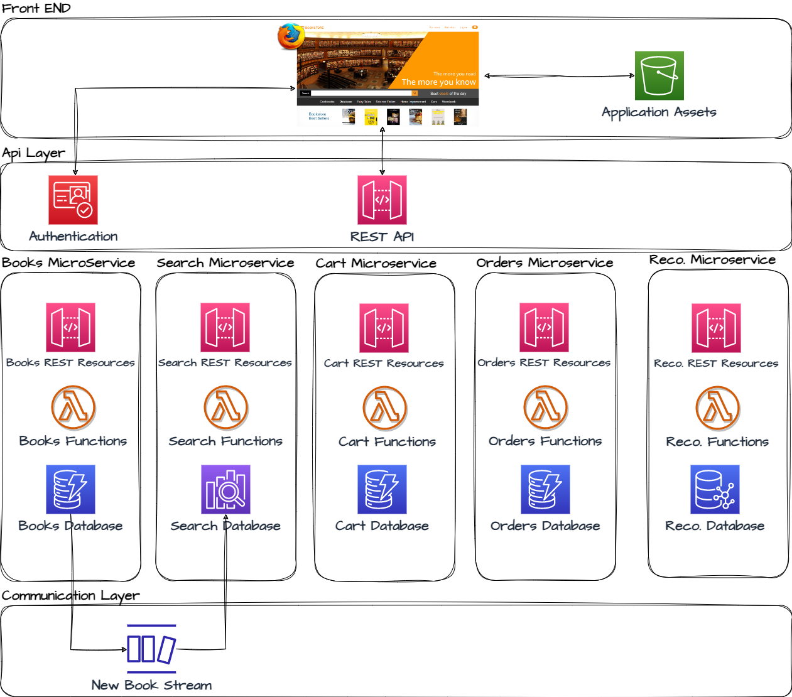

## AWS Bookstore Demo Microservices

This repo contains a demo of a basic microservices architecture with AWS.
It has been built and relies on resources from this demo: 

https://github.com/aws-samples/aws-bookstore-demo-app

which contains one big cloudformation template.
This template is now split into multiple templates (one per microservice) 
which makes things easier to understand and evolve.

---
### !! IMPORTANT NOTES !!

**THIS DEMO CAN INCUR COST**: Creating this demo application in your AWS account will create and consume AWS resources, 
which **will cost money**. We estimate that running this full demo application will cost **~$0.45/hour** with light usage. 
Be sure to shut down/remove all resources once you are finished to avoid ongoing charges to your AWS account 
(see instructions on cleaning up/tear down below).

**THIS IS WORK IN PROGESS** and some parts may not fully work or are missing, 
nevertheless there is already a lot of things to learn at this stage.

It's been tested in **IRELAND** region (eu-west-1) only for the moment.

---

# AWS Bookstore Demo Microservices Big Picture

# 1 - Create REST API, Authentication & Frontend

### Create REST Api & Cognito resources

### Create Frontend & Application Assets

##### How to test this part
After the stack is created, you can access the app interface via cloudfront (the url can be found in the cloudformation stack outputs).

##### Notes
- It can take a few minutes for the app to be accessible via cloudfront.
When it's not accessible yet, you will get an "access denied" error page.

# 2 - Create microservices

### Create cart microservice

##### How to test this part
You can check it works by opening the app, hitting the F12 key and select the network tab. 
Then click on the cart icon and check that the cart apis have been called with no error (the response is empty at this stage).

### Create books microservice

##### How to test this part
You can check it works by opening the app, hitting the F12 key and select network tab. 
Then click a book category (e.g. Cookbooks) and check that the cart apis have been called with no error (the response is empty at this stage).

##### Notes
- There is a dependency between cart and orders microservice (which should not exist in microservices).
The Orders microservice actually empties the cart after checkout (so it needs to know the name of the table).
This should be decoupled in the future.

### Create orders microservice

##### How to test this part
You can check it works by opening the app, hitting the F12 key and select the network tab. 
Then click on the 'Past orders' link and check that the cart apis have been called with no error (the response is empty at this stage).

### Create bookstore VPC

##### Notes
- This VPC is needed by Opensearch and Neptune (which is not the case for dynamodb in the previous services).

### Create Search microservice

##### How to test this part
You can check it works by opening the app, hitting the F12 key and select the network tab. 
Then enter a word in the search bar (e.g. database), hit enter and check that the search apis have been called with no error (the response is empty at this stage).

##### Notes
- This takes more time to provision compare to previous microservices.

- **!!This microservice will be more costly than the previous microservices.!!**

- See how to delete this microservice when you are done in the "Cleaning up Resources" below

### Create Recommendation microservice

##### How to test this part
You can check it works by opening the app, hitting the F12 key and select the network tab. 
Then enter a word in the search bar (e.g. database), hit enter and check that the search apis have been called with no error (the response is empty at this stage)

##### Notes
- This takes more time to provision compare to previous microservices

- **!!This microservice will be more costly than the previous microservices!!**

- See how to delete this microservice when you are done in the "Cleaning up Resources" below

# 3 - Create Communication Layer

### Create Streams

# 4 - Upload Data

### Upload books

##### How to test this part
Open the app and you should see a list of books on the landing page.

### Upload Recommendations

##### How to test this part
Open the app, add a book into your cart and you should see friends who bought that book.

# 5 - Cleaning up Resources

**To tear down only one microservice**, follow these steps:

1. Log into the AWS CloudFormation Console and find the stack you created for the microservice
2. Delete the microservice stack

**To tear down the entire application** and remove all resources associated with AWS Bookstore Demo App, follow these steps:

1. Log into the [Amazon S3 Console](https://console.aws.amazon.com/s3) and  delete the buckets created for the demo app.  
   - There should be two buckets created for AWS Bookstore Demo App.  The buckets will be titled "X" and "X-pipeline", where "X" is the name you specified in the CloudFormation wizard under the AssetsBucketName parameter.  
   - *Note: Please be **very careful** to only delete the buckets associated with this app that you are absolutely sure you want to delete.*
2. Log into the AWS CloudFormation Console and find the stacks you created for the demo app
3. Delete the stacks

*Remember to shut down/remove all related resources once you are finished to avoid ongoing charges to your AWS account.*
